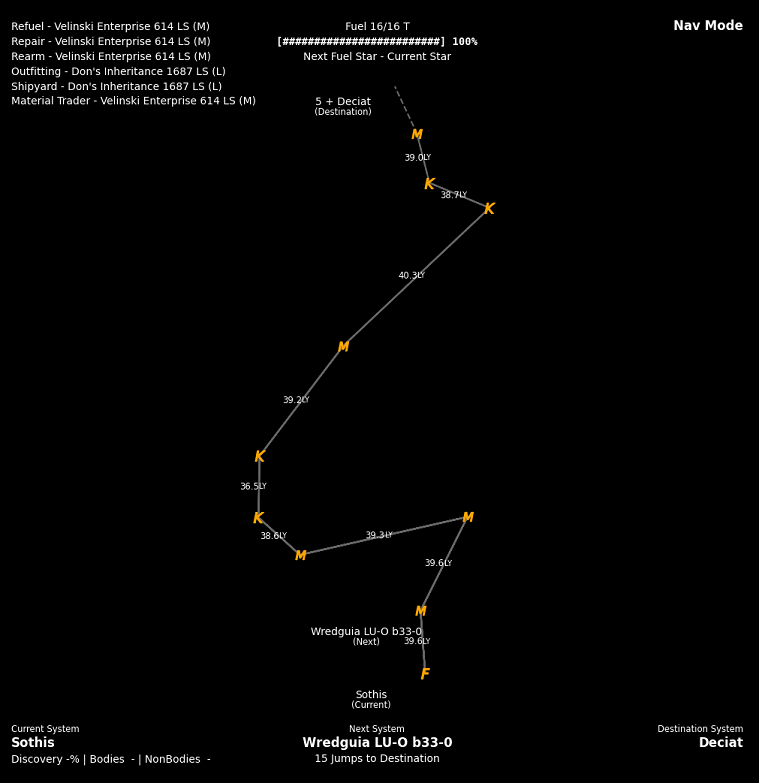
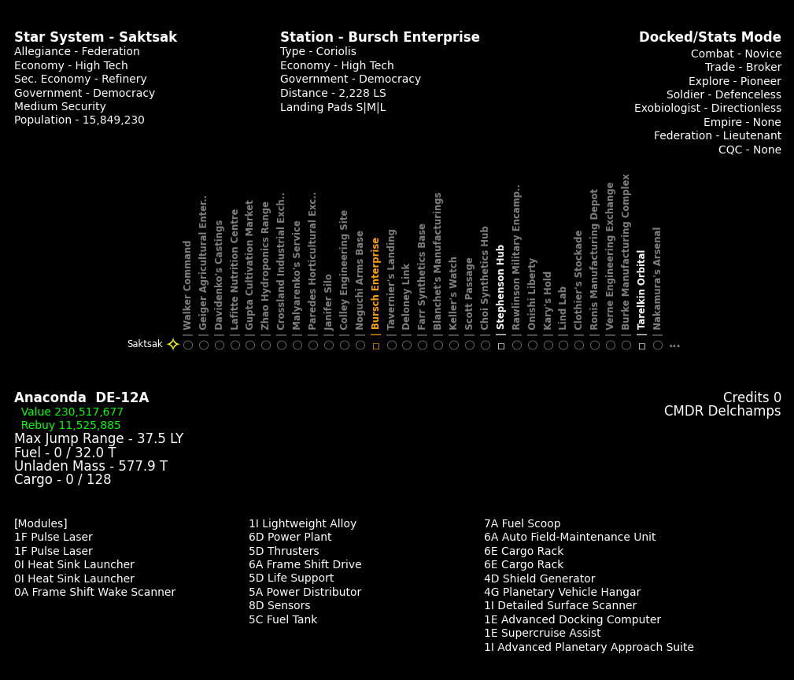

<div id="top"></div>
<!--
*** Thanks for checking out the Best-README-Template. If you have a suggestion
*** that would make this better, please fork the repo and create a pull request
*** or simply open an issue with the tag "enhancement".
*** Don't forget to give the project a star!
*** Thanks again! Now go create something AMAZING! :D
-->


<!-- PROJECT SHIELDS -->
<!--
*** I'm using markdown "reference style" links for readability.
*** Reference links are enclosed in brackets [ ] instead of parentheses ( ).
*** See the bottom of this document for the declaration of the reference variables
*** for contributors-url, forks-url, etc. This is an optional, concise syntax you may use.
*** https://www.markdownguide.org/basic-syntax/#reference-style-links
-->
<!--
[![Contributors][contributors-shield]][contributors-url]
[![Forks][forks-shield]][forks-url]
[![Stargazers][stars-shield]][stars-url]
[![Issues][issues-shield]][issues-url]
[![MIT License][license-shield]][license-url]
[![LinkedIn][linkedin-shield]][linkedin-url]
-->


<!-- PROJECT LOGO -->
<br />
<div align="center">
  <a href="https://github.com/tuxthepenguin84/EDPyPal">
    <!--  -->
  </a>

<h3 align="center">EDPyPal</h3>

  <p align="center">
    Companion tool to visual game data in Elite Dangerous
    <br />
    <a href="https://youtu.be/RadoPQeKJJ0">View Demo</a>
    ·
    <a href="https://github.com/tuxthepenguin84/EDPyPal/issues">Report Bug</a>
    ·
    <a href="https://github.com/tuxthepenguin84/EDPyPal/issues">Request Feature</a>
  </p>
</div>


<!-- TABLE OF CONTENTS -->
<summary>Table of Contents</summary>
<ol>
<li>
  <a href="#about">About</a>
  <ul>
    <li><a href="#built-with">Built With</a></li>
  </ul>
</li>
<li>
  <a href="#getting-started">Getting Started</a>
  <ul>
    <li><a href="#prerequisites">Prerequisites</a></li>
    <li><a href="#installation">Installation</a></li>
  </ul>
</li>
<li><a href="#usage">Usage</a></li>
<li><a href="#roadmap">Roadmap</a></li>
<li><a href="#contributing">Contributing</a></li>
<li><a href="#license">License</a></li>
<li><a href="#contact">Contact</a></li>
<li><a href="#acknowledgments">Acknowledgments</a></li>
</ol>


<!-- ABOUT THE PROJECT -->
## About

EDPyPal is an app I wrote that reads in game data, in real time, in <a href="https://store.steampowered.com/app/359320/Elite_Dangerous/" target="_blank">Elite Dangerous</a> and then shows relevant information.

* Find the closest repair station in the system
* What stars are scoopable in your route
* How many jumps left in your route
* Quickly see what modules you have attached as well as if they are engineered
* And more...

EDPyPal is written in Python and uses matplotlib to draw 3D plots to visualize Elite Dangerous game data. It reads JSON data from C:\Users\userID\Saved Games\Frontier Developments\Elite Dangerous folder and parses it in real time. <b>Any changes are instantly updated and it can auto switch between different views/modes based on if your ship is docked or not. Launch it and let it do it's thing!</b>

EDPyPal is made to run on another monitor in fullscreen.

* <a href="https://youtu.be/RadoPQeKJJ0">Youtube Demo</a>
* Screenshots

<a href="screenshot1.png" target="_blank"></a>
<a href="screenshot2.png" target="_blank"></a>

<!-- <p align="right">(<a href="#top">back to top</a>)</p> -->

Screenshot1 (left) is Nav Mode that shows the following information:
* Top left is closest stations for Refuel, Repair, Rearm, Outfitting, Shipyard, Material Trader (ignores Fleetcarriers and planet landings)
* Top middle is fuel level as well as next fuel star
* Top right is current mode (Nav or Docked/Stats)
* Center middle is is a rotating 3D plot of what you currently have routed in your navigation computer. Current system, next system, and destination system are labeled as well as a number of systems not shown if you have a long route planned (indicated by ----). The 3D plot also shows star types (orange is scoopble, red is non-scoopable) and distance in LY between stars. Plots with dashed lines at the end indicate there are more jumps not shown.
* Bottom left is current system information
* Bottom middle is next system and jumps remaining to destination
* Bottom right is destination system

Screenshot2 (right) is Docked/Stats Mode that shows the following information:
* Top left is current system information
* Top middle is station information
* Top right is rank, credits, commander
* Middle left is ship info/stats, fuel (tons), cargo (tons), jump range
* Bottom is module information, orange colored items indicated engineered items and their level

### Built With

* [Python](https://python.org/)
* [Matplotlib](https://matplotlib.org/)

<p align="right">(<a href="#top">back to top</a>)</p>


<!-- GETTING STARTED -->
## Getting Started

### Prerequisites

* <a href="https://python.org/" target="_blank">Python 3.10</a>
* matplotlib
  ```sh
  pip3 install matplotlib
  ```
* <b>[Optional (Highly Recommended)]</b>
  * Copy JSON data from https://eddb.io/api to<br>
  Elite Dangerous folder: <b>C:\Users\userID\Saved Games\Frontier Developments\Elite Dangerous<br></b>
  This is not required but if you don't have these JSON files specific stats data will not be shown. Also, you will need to update these files every so often as the data changes in Elite Dangerous. EDDB updates them nightly on their website.
  * systems_populated.json
  * stations.json
  * modules.json


### Installation

1. Clone the repo
   ```sh
   git clone https://github.com/tuxthepenguin84/edpypal.git
   ```

<p align="right">(<a href="#top">back to top</a>)</p>


<!-- USAGE EXAMPLES -->
## Usage

Once you have all the pre-reqs installed and the repository cloned you can run EDPyPal.

* You must be in game in Elite Dangerous before you launch EDPyPal! Otherwise it shoes your previous game session which will not update.
* Elite Dangerous needs to be run in <b>Borderless</b> mode in your Elite Dangerous display settings
* <b>Review [open issues](https://github.com/tuxthepenguin84/edpypal/issues), you will almost certainly run into a bug or two</b>

Launch EDPyPal
```sh
python3 path\to\EDPyPal.py
```

<b>To quite EDPyPal, make sure EDPyPal has focus and press the Escape key</b>

### Help

There are a couple optional flags you can run to force specific modes, local, window settings, etc. You can view those with the <b>-h</b> flag.
```sh
python3 path\to\EDPyPal.py -h
```


<p align="right">(<a href="#top">back to top</a>)</p>


<!-- ROADMAP -->
## Roadmap

- [-] More modes (Combat and Mining maybe?)
- [-] More stats on closest system services

See the [open issues](https://github.com/tuxthepenguin84/edpypal/issues) for a full list of proposed features (and known issues).

<p align="right">(<a href="#top">back to top</a>)</p>


<!-- CONTRIBUTING -->
## Contributing

Contributions are what make the open source community such an amazing place to learn, inspire, and create. Any contributions you make are **greatly appreciated**.

If you have a suggestion that would make this better, please create a pull request. You can also simply open an issue with the tag "enhancement".
Don't forget to give the project a star! Thanks again!

1. Create your Feature Branch (`git checkout -b feature/AmazingFeature`)
2. Commit your Changes (`git commit -m 'Add some AmazingFeature'`)
3. Push to the Branch (`git push origin feature/AmazingFeature`)
4. Open a Pull Request

<p align="right">(<a href="#top">back to top</a>)</p>


<!-- LICENSE -->
## License

Distributed under the MIT License.

<p align="right">(<a href="#top">back to top</a>)</p>


<!-- CONTACT -->
## Contact

Sam Dockery - [@SFTuxTweet](https://twitter.com/SFTuxTweet) - samueldockery@gmail.com

Project Link: [https://github.com/tuxthepenguin84/edpypal](https://github.com/tuxthepenguin84/edpypal)

<p align="right">(<a href="#top">back to top</a>)</p>


<!-- ACKNOWLEDGMENTS -->
## Acknowledgments

* [Best-README-Template](https://github.com/othneildrew/Best-README-Template)

<p align="right">(<a href="#top">back to top</a>)</p>
